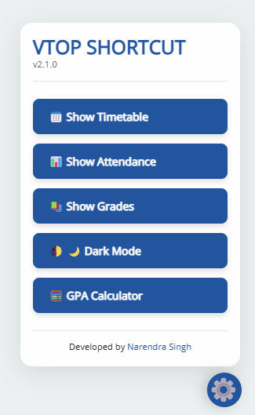

# VIT Portal Helper Extension

A feature-rich Chrome extension that enhances the VTOP portal experience with quick-access shortcuts, GPA calculator, dark mode, and productivity tools.

## Features ✨

- **One-Click Navigation**
  - Instant access to Timetable, Attendance, and Grades
  - Automatic semester selection (BL20242505)
  
- **Smart GPA Calculator**
  - Course credit/grade input system
  - Real-time GPA calculation
  - Non-contributing course tracking
  - Detailed grade explanations

- **Dark Mode Toggle** 🌓
  - System-wide dark theme
  - Persistent storage of preference
  - Custom styling for tables and components

- **Floating Control Panel**
  - Animated settings icon with hover effects
  - Modern UI with version tracking
  - Smooth animations and transitions

- **Additional Tools**
  - Exam countdown timer
  - Quick access popup menu
  - Responsive design for all screen sizes

## Installation 🛠️

1. Clone/download the repository
2. Open Chrome and navigate to:chrome://extensions/
3. Enable "Developer mode" (top-right toggle)
4. Click "Load unpacked" and select the extension folder
5. Pin the extension for easy access

## Usage Guide 🖱️

**Main Interface (VTOP Portal):**

- Click the floating gear icon (bottom-right) to:
- Switch between Dark/Light modes
- Access Timetable/Attendance/Grades
- Open GPA Calculator
- View developer info

**GPA Calculator:**
1. Enter course credits
2. Select grade from dropdown
3. Click "Add Course"
4. View real-time GPA updates
5. Reset with 🔄 button

**Popup Menu:**
- Click extension icon in toolbar to:
- Quick-open Attendance/Timetable
- Access basic GPA calculator
- View exam countdown

## Technologies Used 💻

- Chrome Extension APIs (Manifest v3)
- Modern JavaScript (ES6+)
- CSS3 Animations & Flexbox/Grid
- Chrome Storage API
- DOM Manipulation
- Content Script Injection

## Permissions 🔒

- `activeTab`: Modify current VTOP page
- `storage`: Save user preferences
- `scripting`: Inject content scripts
- `alarms`: Future feature development

## Development 🧑💻

**File Structure:**
├── background.js - Extension lifecycle management
├── content.js - Main interface logic (90% of features)
├── manifest.json - Extension configuration
├── popup.html - Popup menu UI
├── popup.js - Popup functionality
└── icons/ - Extension icons (various sizes)

**To Contribute:**
1. Fork the repository
2. Create feature branch
3. Test changes thoroughly
4. Submit PR with detailed description

## Troubleshooting ⚠️

**Common Issues:**
- Buttons not appearing:
  - Refresh VTOP page
  - Check content script matches in manifest
- GPA not calculating:
  - Ensure valid number in credits field
  - Verify grade selection
- Dark mode glitches:
  - Toggle mode twice to reset

## Future Roadmap 🚀

- [ ] Automatic semester detection
- [ ] Exam schedule integration
- [ ] Notification system
- [ ] Cross-browser support
- [ ] Mobile-responsive UI

## License 📄
[MIT License](LICENSE) - Open source, free for educational use

---

**Created with ❤️ by [Narendra Singh](https://github.com/monu808)**  
[Report Issues](https://github.com/monu808/vit-helper/issues) | [View Changelog](CHANGELOG.md)